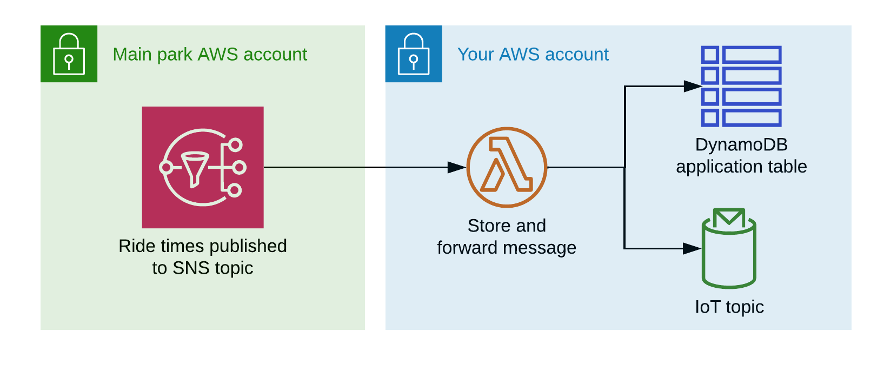
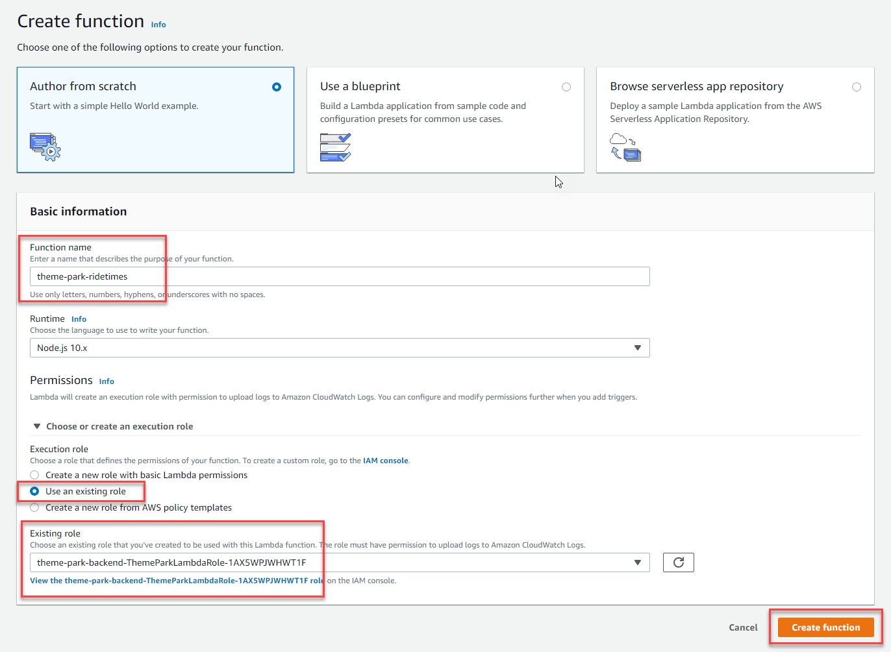
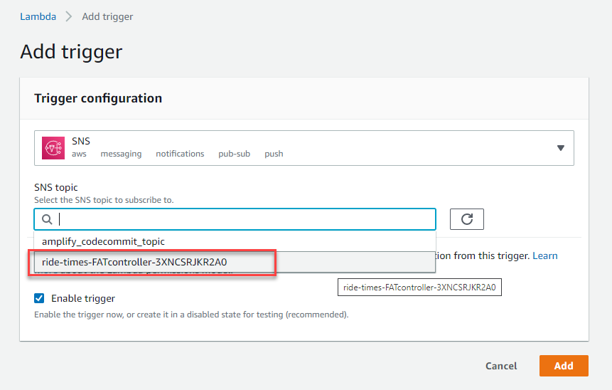
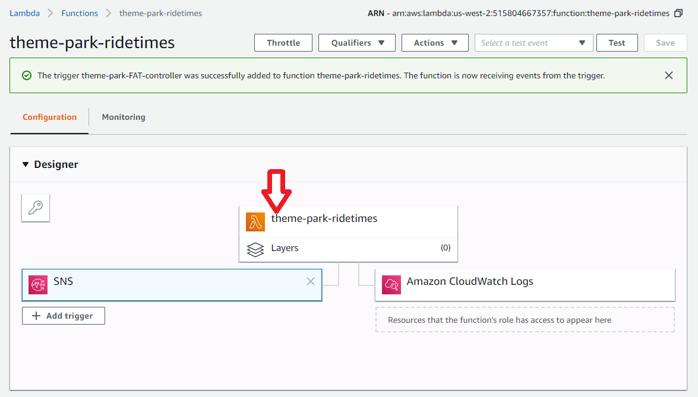
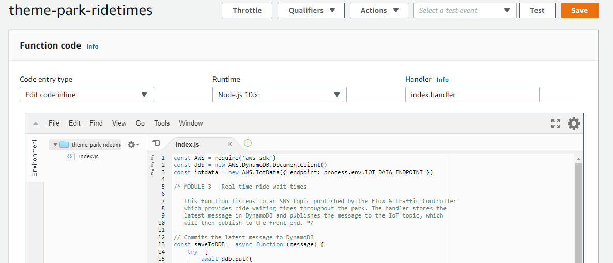
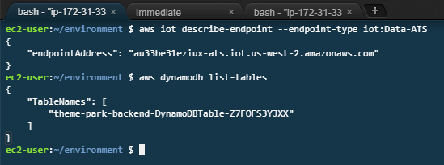
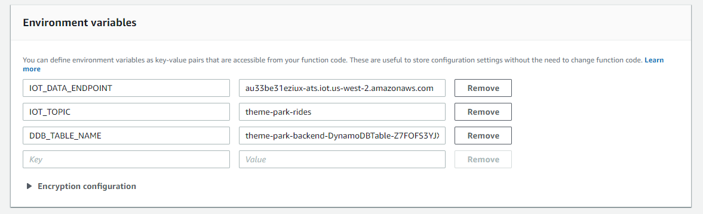
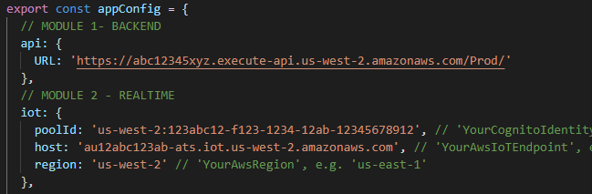

# Module 2: Real-time ride wait times

## Overview

The theme park uses a proprietary system called the **Flow & Traffic Controller** to estimate wait times for rides. To help ease congestion, you will publish ride times directly into the application so guests can plan their day. 

:video_camera: This module is also available to [watch on YouTube](https://www.youtube.com/watch?v=DlaR1EzeXnA).

## How it works

* The Controller publishes updates every minute to an Amazon SNS topic. This has already been created for you.
* You will create a Lambda function in your account that is invoked whenever notifications arrive on this topic. This function will store the message in DynamoDB and forward the message to IoT Core.
* Finally, you will update the front-end application configuration to listen to this IoT endpoint, and republish the frontend.

*More information on the services introduced in this section:*
* [Amazon Simple Notification Service](https://aws.amazon.com/sns/)
* [AWS IoT Core](https://aws.amazon.com/iot-core/)

## The Real-Time Serverless Backend



* The Flow & Traffic Controller exists in a separate AWS account owned by the theme park. You are provided with the SNS topic ARN to use.
* The Lambda function receives new messages as an event payload and parses out the message. It then stores the message in a DynamoDB table and forwards to an IoT topic.
* The DynamoDB table only stores the last message. This initial state is needed when the front-end application is first loaded.
* The IoT topic is the conduit from the serverless backend to the front-end application. Any messages posted here will be received by the front-end.

## Set up environment variables

Run the following commands in the Cloud9 terminal to set environment variables used in this workshop:

```console
AWS_REGION=$(curl -s http://169.254.169.254/latest/meta-data/placement/availability-zone | sed 's/\(.*\)[a-z]/\1/')
accountId=$(curl -s http://169.254.169.254/latest/dynamic/instance-identity/document | jq -r .accountId)
s3_deploy_bucket="theme-park-sam-deploys-${accountId}"
```

## Create the Lambda function

**:white_check_mark: Step-by-step Instructions**

1. Go to the Lambda console - from the AWS Management Console, select **Services** then select [**Lambda**](https://console.aws.amazon.com/lambda) under *Compute*. **Make sure your region is correct.** You will see some Lambda functions that SAM has already deployed.

2. Select **Create function**. Ensure **Author from scratch** is selected. Enter `theme-park-ridetimes` for *Function name* and ensure `Node.js 12.x` is selected under *Runtime*. 

3. Open the *Choose or create an execution role* section:
-  Select the *Use an existing role* radio button. 
- Click the *Existing role* drop-down, and enter **ThemeParkLambdaRole** until the filter matches a single available role beginning with *theme-park-backend-ThemeParkLambdaRole**. 
- Select this role.
- Select **Create function**.



3. Expand the *Designer* section. Select **+ Add trigger**. In the *Trigger configuration* dropdown, choose **SNS**. In the SNS topic selector, select the SNS topic starting with `theme-park-ride-times`: 



4. Leave *Enable trigger* checked, and choose *Add*.

5. In the *Designer* section, select the **theme-park-ridetimes** option which has the Lambda logo. This opens the *Function code* card below.



6. Back in the Cloud9 browser tab, in the left directory panel navigate to `theme-park-backend\2-realtime\app.js`. Double click to open the file and copy the contents onto the clipboard. 

7. Go back to the browser tab with the Lambda console. In the *Function Code* card, click on the `index.js` file paste the file contents in the clipboard into the `index.js` file, overwriting the existing content.  

8. On the top right of the Function code panel, select **Deploy** to save the changes and deploy the function.



This Lambda function code reads the latest message from the SNS topic, writes it to DynamoDB and then pushes the message to the frontend application via an IoT topic.

## Adding environment variables

This function uses three environment variables:
- `IOT_DATA_ENDPOINT`: the IoT endpoint hostname.
- `IOT_TOPIC`: The name of the IoT topic to publish messages to, which is `theme-park-rides`.
- `DDB_TABLE_NAME`: The name of the application's DynamoDB table.

In this section, you will retrieve and configure these Environment Variables for the function.

**:white_check_mark: Step-by-step Instructions**

1. Go back to your browser tab with Cloud9 running. If you need to re-launch Cloud9, from the AWS Management Console, select **Services** then select **Cloud9** under *Developer Tools*. **Make sure your region is correct.**

2. In the terminal enter the following command to retrieve the value for IOT_DATA_ENDPOINT:

```
aws iot describe-endpoint --endpoint-type iot:Data-ATS
```
3. Next, enter the following command to retrieve the value for DDB_TABLE_NAME:
```
aws dynamodb list-tables | grep backend
```


4. Go back to the browser tab with the `theme-park-ridetimes` Lambda function open. Scroll down to the *Environment variables* card, click **Edit**, and then choose **Add environment variable**.

5. Enter the three environment variables with the three values, as follows:
- IOT_DATA_ENDPOINT - the value from step 2 above (without quotes).
- DDB_TABLE_NAME - the value from step 3 above (without quotes).
- IOT_TOPIC - `theme-park-rides`



:heavy_exclamation_mark: Ensure you have entered the environment variables into the *Environment variables* card, not the *Tags* card.

5. Choose **Save**.

## Updating the frontend

To enable the frontend to listen to the IoT topic for ride time messages, you will need these two values:

- IoT endpoint hostname
- The Cognito Identity Pool ID.

In this section, you will retrieve these values and update the frontend configuration. After making the change, you will commit the change to the git repo, which will automatically republish the application using Amplify Console..

**:white_check_mark: Step-by-step Instructions**

1. Go back to your browser tab with Cloud9 running. If you need to re-launch Cloud9, from the AWS Management Console, select **Services** then select **Cloud9** under *Developer Tools*. **Make sure your region is correct.**

2. Run this command to show the **IdentityPool Id**:
   
```
aws cognito-identity list-identity-pools --max-results 10
```
3. Run this command to show the **IoT endpoint hostname**:

```
aws iot describe-endpoint --endpoint-type iot:Data-ATS
```
4. Run this command to show the **AWS REGION**:

```
echo $AWS_REGION
```
5. In the Cloud9 terminal, in the left directory panel navigate to `theme-park-frontend/src`. 

6. Locate the **config.js** file and double-click to open in the editor.

This file contains a JSON configuration for the frontend. The file is separated into modules that correspond with the modules in this workshop.

7. In the **MODULE 2** section at the beginning of the file, update the *iot* attributes as follows:

- `poolId`: set to the **IdentityPool Id** from the section above.
- `host`: set to the **IoT endpoint hostname** from the section above.
- `region`: set to your **AWS_REGION** from the section above (e.g. `'us-west-2'`).



8. **Save the file.**

### Push to CodeCommit and deploy via Amplify

1. In the Cloud9 terminal, change to the front-end directory with the following command:
``` 
cd ~/environment/theme-park-frontend/
```
2. Commit to CodeCommit by executing the following commands:
```
git commit -am "Module 2"
git push
```
3. After the commit is completed, go to the [Amplify Console](https://console.aws.amazon.com/amplify/). **Make sure you are in the correct region.**
4. In the *All apps* section, click **theme-park-frontend**.

You will see a new build has automatically started as a result of the new commit in the underlying code repo. This build will take a few minutes. Once complete:

5. Open the published application URL in a browser.

You can now see the rides and attractions on the theme park map show realtime wait times that update every minute.

## Module review

In this module you:

- Connected your backend application with the Flow & Traffic Controller's SNS topic.
- Created a Lambda function that was invoked by the SNS topic whenever a new message is published.
- Set up IAM permissions so your Lambda function could write this message to the application's DynamoDB table, and publish the message to the IoT topic for the front end.
- Updated the frontend with the configuration information so it can listen to new messages on the IoT topic.

Once you have seen the new functionality in the published application URL, proceed to the next module, where you will add ride photo processing.

## Next steps ## 

[Click here](../3-photos/README.md) to continue to Module 3.
