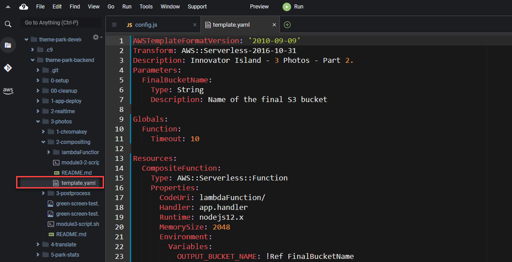
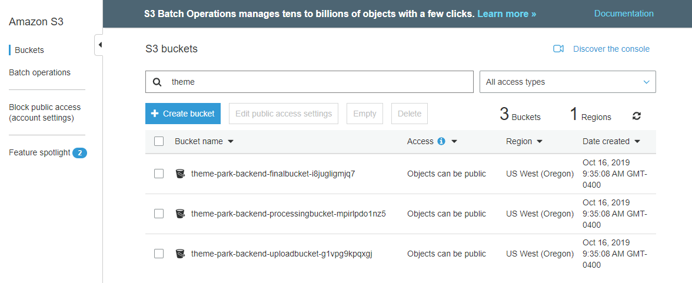
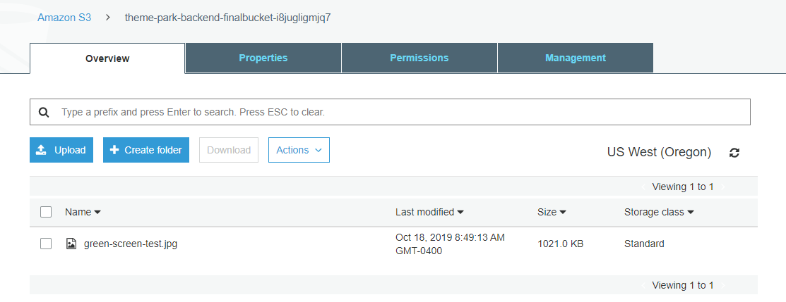

# Module 3: On-ride photo processing - Creating the photo compositing Lambda function

*[Click here](../README.md) to return to the main instructions for Module 3 at any time.*

The function takes the processed image from the previous section - the person with the green background removed - and composites various graphics elements into a final image. This final image is saved in the final bucket.

## Inside this section

In the last section, you built a Lambda function manually through the console. However, if your function contains packages or libraries, it's easier to use automation to help you bundle assets together for deployment.

In this part, you will use the AWS Serverless Application Model (SAM) to automate the package and deployment of the function.

## SAM and YAML

The AWS SAM template file is a YAML or JSON configuration file. You use the template to declare all of the AWS resources that make up your serverless application.   

1. Go to your browser tab with Cloud9 running. If you need to re-launch Cloud9, from the AWS Management Console, select **Services** then select [**Cloud9**](https://console.aws.amazon.com/cloud9) under *Developer Tools*. **Make sure your region is correct.**

2. In the Cloud9 file explorer panel, navigate to and open  `theme-park-backend\3-photos\2-compositing\template.yaml` to review its contents.



SAM will read this file and convert this YAML into infrastructure. Some of the important sections for today include:

- **Parameters**: the function needs to know the name of the final bucket, so you can provide this as a parameter to the template.
- **Globals**: any settings here will apply across the entire template.
- **Resources**: defines the AWS resources to create.

Within the Resources section:
- The template defines a single Lambda function called *CompositeFunction*.
- It specifies the runtime, memory size and where the code can be located (in the `lambdaFunction` directory).
- It defines an environment variable, which uses the `FinalBucketName` parameter as an input.
- It provides the IAM policy to enable access for the function to S3.

## Create the Lambda function using SAM

**:white_check_mark: Step-by-step Instructions**

1. Change directory:

```
cd ~/environment/theme-park-backend/3-photos/2-compositing
```

2. You can see the name of the final S3 bucket using the following command which has been already stored as an environment variable ```$FINAL_BUCKET```. SAM will be configured to use this S3 bucket name to set the environment variable within the Lambda function.

```
aws s3 ls | grep finalbucket
```

3. In the terminal, execute the following SAM CLI commands which will **build** the SAM application, **package** the code with the same SAM S3 deployment bucket previously used and then **deploy** the application specifying the S3 Final Bucket name for the Lambda function to use:
```
sam build

sam package --output-template-file packaged.yaml --s3-bucket $s3_deploy_bucket

sam deploy --template-file packaged.yaml --stack-name theme-park-photos --capabilities CAPABILITY_IAM --parameter-overrides "FinalBucketName"=$FINAL_BUCKET

``` 
This will take a few minutes to deploy - wait for the confirmation message in the console before continuing.

## Adding the S3 trigger

Now you have created the Lambda function, you need to configure how it is invoked. This compositing function needs to execute when a new object is put into the **processingbucket**. In this section, you will create this trigger.

**:white_check_mark: Step-by-step Instructions**

1. Go to the Lambda console - from the AWS Management Console, select **Services** then select **Lambda** under *Compute*. **Make sure your region is correct.**

2. Select the function with the name `theme-park-photos-CompositeFunction-XXXXXXXXX`.

3. Select **+ Add Trigger**:
   - In the *Trigger configuration* dropdown, Select **S3**. 
   - In the Bucket dropdown, select the bucket name beginning with `theme-park-backend-processingbucket`. 
   - For *Event Type* select **All object create events** from the dropdown. 
   - Leave *Enable trigger* checked, and select **Add**.

## Test the function

You will now test the function using a test image containing a photo of a person against a green background. You will copy this image into the **uploadbucket**, and see the final result in the **finalbucket**.

**:white_check_mark: Step-by-step Instructions**

1. Go back to your browser tab with Cloud9 running. If you need to re-launch Cloud9, from the AWS Management Console, select **Services** then select **Cloud9** under *Developer Tools*. **Make sure your region is correct.**

2. In the terminal enter the following command to change the directory:

```
cd ~/environment/theme-park-backend/3-photos/
```
3. You can see the name of your S3 upload bucket with this command:
```
aws s3 ls | grep uploadbucket
```
4. Copy the local testing image to your upload bucket. The command will use the previously created environment variable ```$UPLOAD_BUCKET``` which is set to this bucket name:
```
aws s3 cp ./green-screen-test.png s3://$UPLOAD_BUCKET
```
5. In another tab, open the S3 console.



6. Choose the `theme-park-backend-finalbucket`.



7. Check the `green-screen-test.jpg` object, then select **Download**.

8. Save the file locally and open in an image viewer. 

9. You will see photo of the person has had the green background removed, and is now composited with the theme park background and logo graphics.

## Next steps

Next, you will create the post-process Lambda function to store result in DynamoDB and notify the front-end. To start the next section, [click here to continue](../3-postprocess/README.md).

