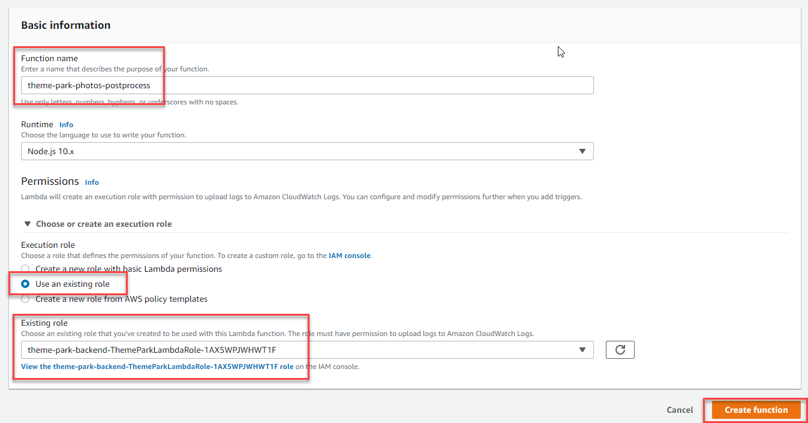
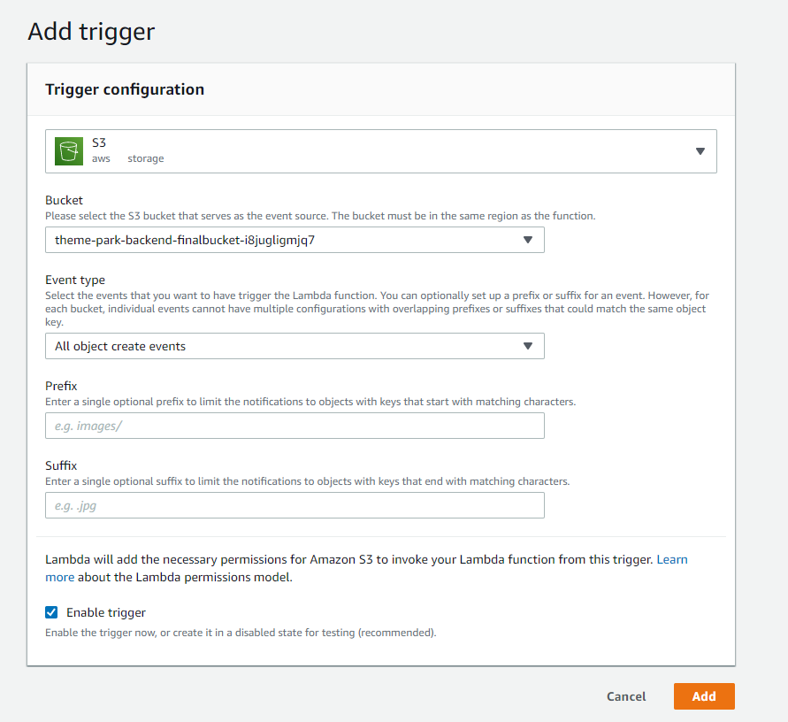
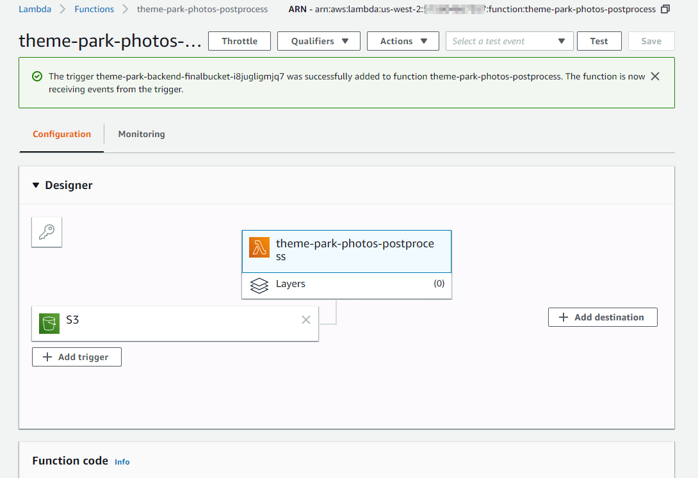
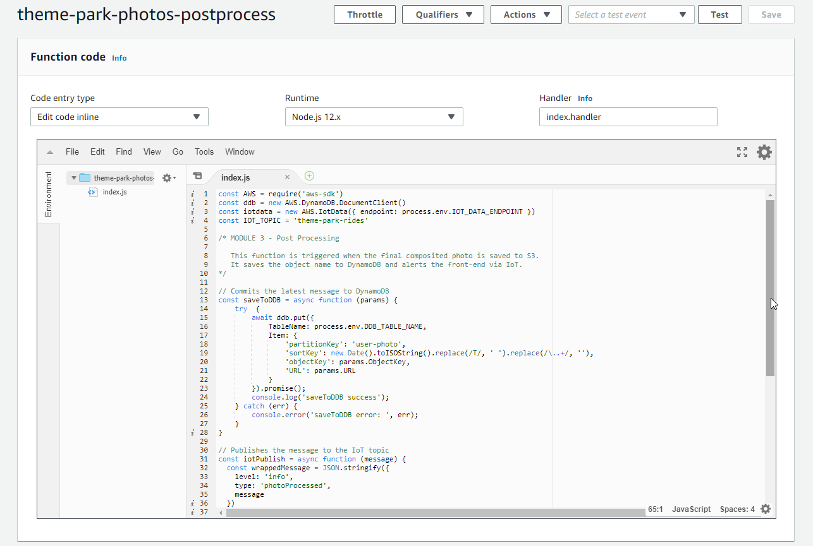
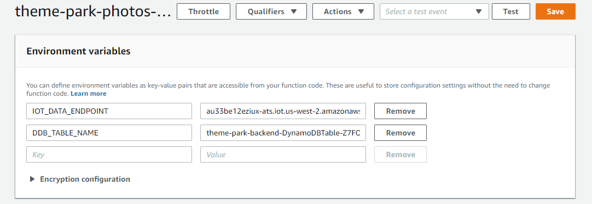
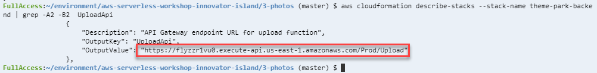
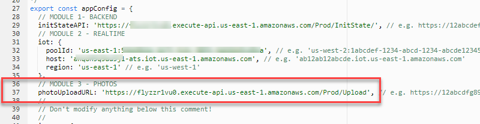

# Module 3: On-ride photo processing - Post-processing

*[Click here](../README.md) to return to the main instructions for Module 3 at any time.*

The final Lambda function in the photo processing pipeline is triggered when the final image is rendered and saved into the S3 **finalbucket**. It will save the photo object information into DynamoDB and send a message to the IoT topic so the frontend application is notified.

## Inside this section

You will build this Lambda function in the console to complete the final step of the photo processing workflow.

After you will test with the sample image, and then perform a test from the frontend application with your own photo.

## Creating the Lambda function

**:white_check_mark: Step-by-step Instructions**

1. Go to the Lambda console - from the AWS Management Console, select **Services** then select [**Lambda**](https://console.aws.amazon.com/lambda) under *Compute*. **Make sure your region is correct.**

2. Select **Create function**. Enter `theme-park-photos-postprocess` for *Function name* and ensure `Node.js 12.x` is selected under *Runtime*. 

3. Open the *Choose or create an execution role* section:
-  Select the *Use an existing role* radio button. 
- Click the *Existing role* drop-down, and enter **ThemeParkLambdaRole** until the filter matches a single available role beginning with *theme-park-backend-ThemeParkLambdaRole**. 
- Select this role.
- Select **Create function**.



3. Select **+ Add trigger**:
   - In the *Trigger configuration* dropdown, select **S3**. 
   - In the Bucket dropdown, select the bucket name beginning with `theme-park-backend-finalbucket`. 
   - For *Event Type* select **All object create events** from the dropdown. 
   - Leave *Enable trigger* checked, and select **Add**.



5. In the *Designer* card, select the **theme-park-photos-postprocess** Lambda function to open the *Function code* panel below.



6. Copy the code from `3-postprocess/app.js` onto the clipboard and paste into the `index.js` tab in the Lambda function overwriting the existing content:

7. **Select *Deploy* in the *Function Code* panel to save the changes and deploy the function.**



### Adding environment variablesW

This function uses two environment variables:
- `IOT_DATA_ENDPOINT`: the IoT endpoint hostname.
- `DDB_TABLE_NAME`: the DynamoDB table name used by the application.

In this section, you will retrieve and configure these Environment Variables for the function.

**:white_check_mark: Step-by-step Instructions**

1. Go back to your browser tab with Cloud9 running. If you need to re-launch Cloud9, from the AWS Management Console, select **Services** then select [**Cloud9**](https://console.aws.amazon.com/cloud9) under *Developer Tools*. **Make sure your region is correct.**

2. In the terminal enter the following command to retrieve the value for `IOT_DATA_ENDPOINT`:
```
aws iot describe-endpoint --endpoint-type iot:Data-ATS
```
3. Next, enter the following command to retrieve the value for `DDB_TABLE_NAME`:
```
aws dynamodb list-tables | grep backend
```

4. Go back to the browser tab with the `theme-park-photos-postprocess` Lambda function open. Scroll down to the *Environment variables* card, click **Edit**, and enter the two environment variables names along with the values you retrieved in Cloud9 (without quotes):



5. **Choose *Save* to save these changes.**

## Update the frontend

In this section, you will update the frontend with the API endpoint where it can request photo uploads. You will then commit the change to CodeCommit, which will cause the frontend to be republished.

**:white_check_mark: Step-by-step Instructions**

1. Go back to your browser tab with Cloud9 running. If you need to re-launch Cloud9, from the AWS Management Console, select **Services** then select **Cloud9** under *Developer Tools*. **Make sure your region is correct.**

2. In the terminal, run this command to show the uploads API from when the backend was deployed in module 1:
```
aws cloudformation describe-stacks --stack-name theme-park-backend --query "Stacks[0].Outputs[?OutputKey=='UploadApi'].OutputValue" --output text
```
3. Copy the output URL to the clipboard:



4. In the Cloud9 terminal, in the left directory panel navigate to **theme-park-frontend/src**. 

5. Locate the `config.js` file and double-click to open in the editor.

This file contains a JSON configuration for the frontend. The file is separated into modules that correspond with the modules in this workshop.

6. In the **MODULE 3** section, between the single quote marks `''`, update the *photoUploadURL* with the API Endpoint URL in the clipboard.

7. Save the file.



### Push to CodeCommit and deploy via Amplify

1. In the Cloud9 terminal, change to the front-end directory with the following command:
``` 
cd ~/environment/theme-park-frontend/
```
2. Commit to CodeCommit by executing the following commands:
```
git commit -am "Module 3 - Photo compositing"
git push
```
3. After the commit is completed, go to the [Amplify Console](https://console.aws.amazon.com/amplify/).
   
4. In the *All apps* section, click **theme-park-frontend**.

You will see a new build has automatically started as a result of the new commit in the underlying code repo. This build will take a few minutes until the *Verify* stage is complete

1. Open the published application URL in a browser.

Click on one of the ride profiles to open the ride description page. You can see a new button has appeared - "Add ride photo".

## Test the function

It's time to complete a full end-to-end test with the front-end application using your smartphone - this step requires the use of an iPhone or Android device. 

In the workshop room, there are a number of physical greenscreens. Find an available greenscreen to take a selfie.

1. Open the published application URL from Amplify Console on your smartphone.
2. Click on a ride profile from the main map.
3. On the ride description page, click *Add ride photo*.
4. Position yourself in the greenscreen so that green completely fills the background, and your body and face are located in the middle of the frame.
5. Upload the photo.

The frontend application will notify you when the photo is uploaded. You will see a second notification when the composited photo is ready to view.

You will see a Gallery icon has appeared in the toolbar. Click on this icon to view your composited photo.

Finally, click the *Share on Twitter* button. Tweet out your photo with the hashtag #InnovatorIsland!

## Next steps

[Click here](../../4-translate/README.md) to continue to Module 4.
