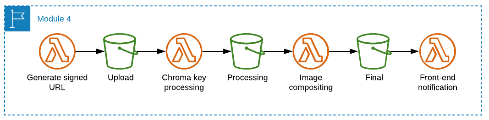

# Module 3: On-ride photo processing

## Overview

Park guests love taking photos on the rides and attractions. This app feature will let guests take a selfie and see a composited picture in the application. From here, they can publish their masterpiece on social media.

:video_camera: This module is also available to [watch on YouTube](https://www.youtube.com/watch?v=fcNWup_TmVA).

## How it works

* The front-end calls an API endpoint to get a presigned URL to upload the photo to S3. This enables the front-end application to upload directly to S3 without a webserver. This results in a new JPG object in the S3 **Upload** bucket.
* When a new object is written to the Upload bucket, this invokes the first Lambda function in the sequence, which uses a process called Chromakey to remove the green screen background from the image. The resulting image is written to the **Processing** bucket.
* When a new object is written to the Processing bucket, this invokes the next Lambda function which composites the image with a new background and theme park logo. This resulting image is written into the **Final** bucket.
* Lastly, when a new object is written to the Final bucket, this invokes the final Lambda function which sends a notification to IoT core that the file is ready. This notifies the front-end application via the IoT topic *notifications*.

## The Serverless Backend



1. The image is uploaded by the front-end into the Upload Bucket.
2. A chromakey process removes the background and saves the object into the Processing Bucket.
3. A compositing process creates a final image that is saved into the Final Bucket.
4. A message is sent to IoT Core to notify the front-end that the file is now ready.

In this module, you will deploy three Lambda functions. Once set up, you will update the front-end code  to enable the upload process.

Once configured, you will:

- Test the backend using a sample image to ensure the flow is working as expected.
- Test the frontend by taking a selfie against the green screens in the workshop room, and Tweet it to the world!

## Set up environment variables

Run the following commands in the Cloud9 terminal to set environment variables used in this workshop:

```console
AWS_REGION=$(curl -s http://169.254.169.254/latest/meta-data/placement/availability-zone | sed 's/\(.*\)[a-z]/\1/')
FINAL_BUCKET=$(aws cloudformation describe-stack-resource --stack-name theme-park-backend --logical-resource-id FinalBucket --query "StackResourceDetail.PhysicalResourceId" --output text)
accountId=$(curl -s http://169.254.169.254/latest/dynamic/instance-identity/document | jq -r .accountId)
s3_deploy_bucket="theme-park-sam-deploys-${accountId}"
```

## Deploy the infrastructure

There are three sub-sections to this module:

1. [Creating the chromakey Lambda function](./1-chromakey/README.md)
2. [Creating the compositing Lambda function](./2-compositing/README.md)
3. [Creating the post-processing notification Lambda function](./3-postprocess/README.md)

To start the first section, [click here to continue](./1-chromakey/README.md).

