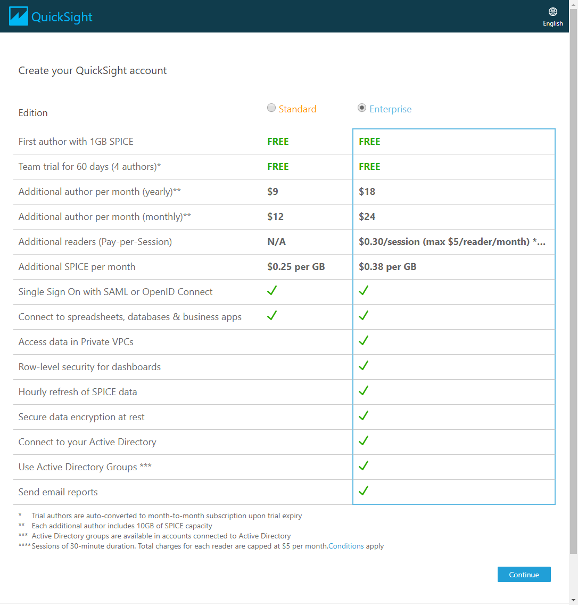
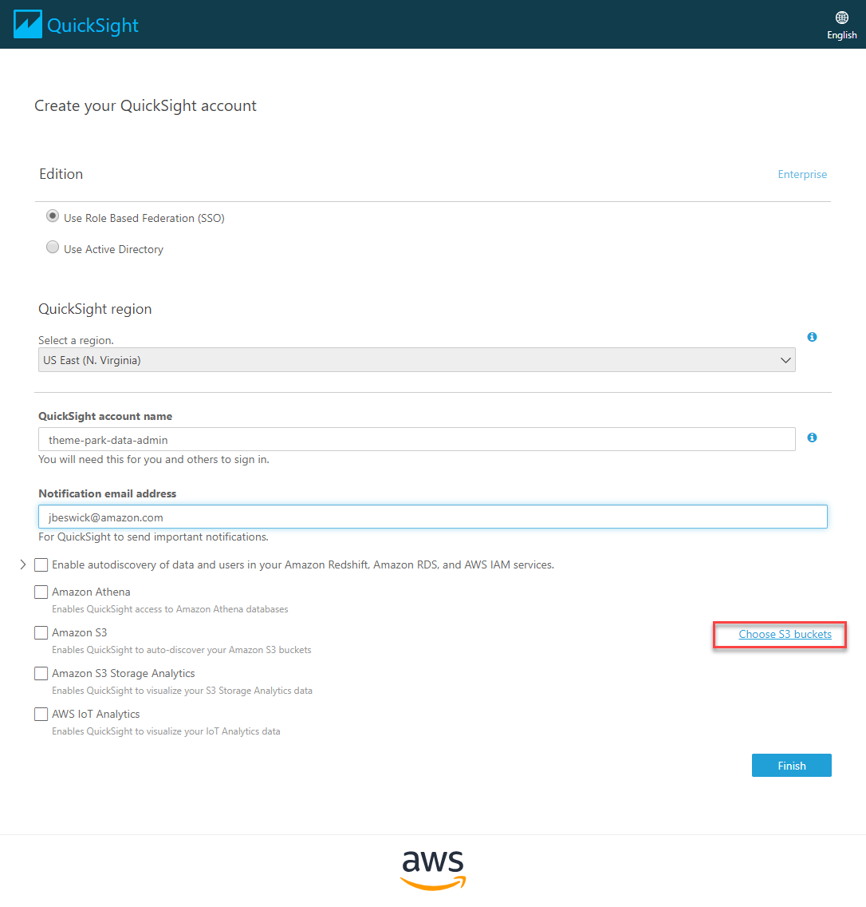
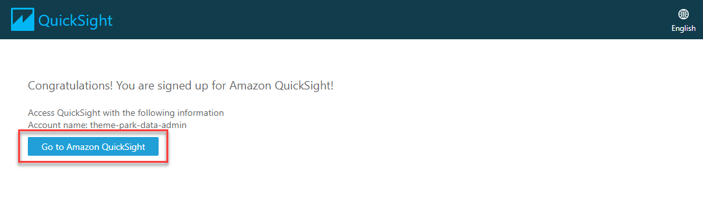
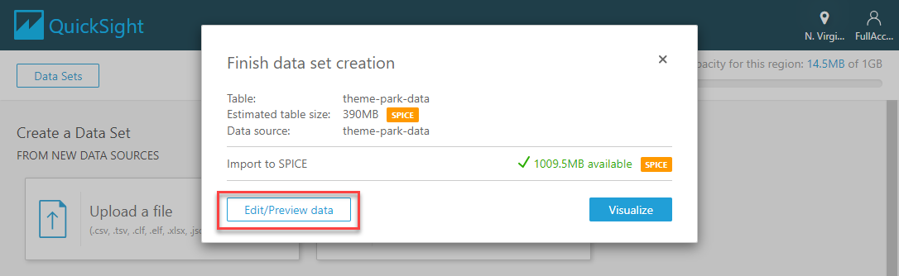
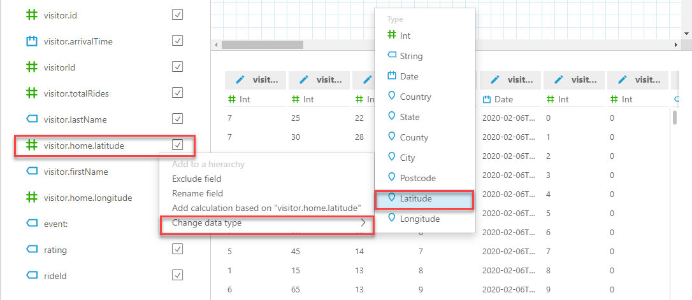
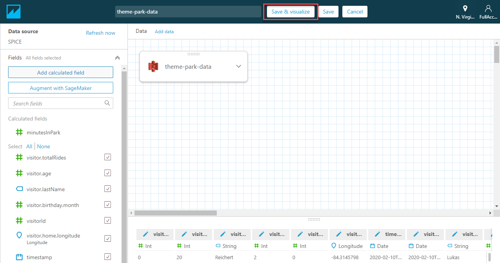
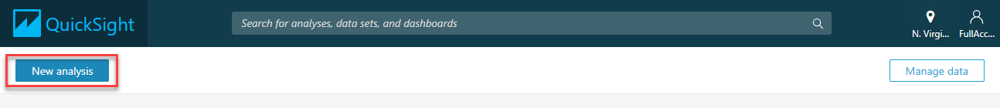
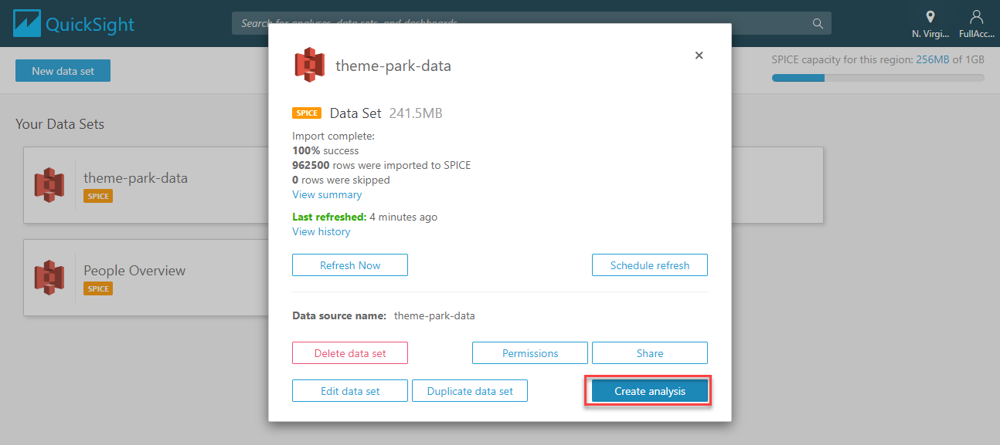
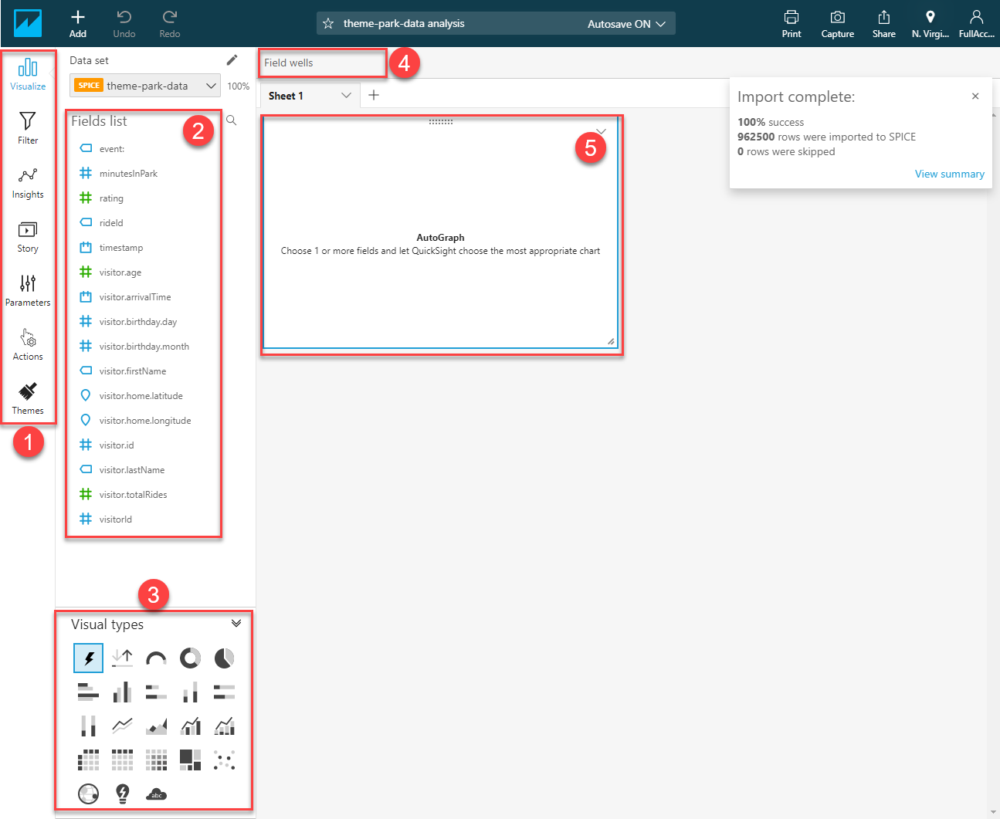

# Module 5: Analyzing visitor stats - (c) Configure and use QuickSight

*[Click here](../README.md) to return the main instructions for Module 5 at any time.*

Using the data from the simulation, you will use Amazon QuickSight to answer questions related to the operation of the theme park. In this section, you will configure QuickSight and create insights based on the simulation data.

## Creating a QuickSight account

**:white_check_mark: Step-by-step Instructions**

1. Go to the AWS Management Console, click **Services** then select **QuickSight** under Developer Tools. **Make sure your region is correct.**

2. Choose **Sign up for QuickSight**.


3. In the *Create your QuickSight account* page, select the **Standard** option and choose **Continue**.



4. In the next page in the sign-up process:
- Leave *Use Role Based Federation (SSO)* selected.
- For *Region*, select the region in the dropdown you have been using in the workshop.
- For *QuickSight account name*, enter `theme-park-admin-` followed by your AWS account ID.
- For *Notification email address*, enter your email address.
- Uncheck any checked boxes.
- Click **Choose S3 buckets*

**:star:You can find your AWS Account ID by clicking your name in the menu bar at the top of the page.**



5. In the *Select Amazon S3 buckets* popup, check the S3 bucket beginning with `theme-park-data`. Choose **Finish**.


6. Finally, choose **Finish**.

7. QuickSight will now create your account. The process takes a few seconds. Choose **Go to Amazon QuickSight** when the button is available.



8. Close any *What's New* splash screens that may appear.

## Configure QuickSight

First, you must connect a data source and prepare the data for analysis.

**:white_check_mark: Step-by-step Instructions**

1. Choose **Manage data**.


2. Choose **New data set**.


3. Choose **S3**.


4. Open a text editor on your local machine, and paste the following contents. Ensure you enter your S3 bucket name
(the bucket beginning with `theme-park-data`) and save the file as `manifest.json`.

```
{
   "fileLocations":[
      {
         "URIPrefixes":[
            "s3://ENTER-YOUR-BUCKET-NAME/"
         ]
      }
   ],
   "globalUploadSettings":{
      "format":"JSON"
   }
}
```

5. On the *New S3 data source* form:
- Enter `theme-park-data` for *Date source name*.
- Select the *Upload* radio button.
- Choose the file uploader icon and select the manifest file saved in the previous step.
- Choose **Connect**.


6. On the *Finish data set creation* dialog box, choose **Edit/Preview data**.



### Prepare the data

You must change the datatypes of some fields for QuickSight to use these properly in visualization.

1. On the left of the page, there is the list of fields found in the dataset. Hover your mouse over the *visitor.home.latitude* field, select *Change data type* and then select **Latitude**.



2. Hover your mouse over the *visitor.home.longitude* field, select *Change data type* and then select **Longitude**.

3. Hover your mouse over the *rating* field, select *Change data type* and then select **Int**.

4. Choose **Add calculated field**.
- For *Calculated Field Name*, enter **minutesInPark**.
- For *Formula*, enter `dateDiff(visitor.arrivalTime, timestamp, "MI")`.
- Choose **Create**.


4. Choose **Save & visualize**.



## Create analysis

1. Click the *QuickSight* logo in the top left of the screen to return to the application's main menu. Choose **New analysis**.



2. In *Your Data Sets*, choose **theme-park-data**.


3. Choose **Create analysis**.



4. In the analysis dashboard, note the following areas on the display, since you will need these to build the data visualizations:
- 1 - Analysis menu bar.
- 2 - Fields list.
- 3 - Visualization types.
- 4 - Field wells, for modifying fields in visualizations.
- 5 - Worksheet, containing multiple visualization panels.



Each of the visualization challenges is completed using the analysis dashboard. 

## Building visualizations

Add each of the following visualizations to your analysis dashboard:

1. Average length of park visit by age. [Go to instructions...](./visual1.md)
2. Where are the visitors from? [Go to instructions...](./visual2.md)
3. Arrival time by visitor age. [Go to instructions...](./visual3.md)
4. Ride rating by popularity. [Go to instructions...](./visual4.md)
5. How many total rides today? [Go to instructions...](./visual5.md)

Once you have the five visualulations on your worksheet, rename your worksheet, and resize the visualizations to fit the dashboard.


## Advanced challenges

Now you can see what QuickSight can do, there are three advanced challenges to complete. To learn more about how to use the tools to complete these challenges, [refer to the Amazon QuickSight Quick Start Guide](https://docs.aws.amazon.com/quicksight/latest/user/quickstart.html).

### 1. Free on your birthday 

Park Management is considering offering free entrance to anyone on their birthday. Tickets are currently $89 a day. Create a visualation showing how many visitors today celebrated their birthdays, and what the total cost of the program would be, based on today's attendance.

### 2. Staffing the turnstiles

(a) Park Management is looking to optimize staffing at the park entrance. There are 100 turnstiles, each capable of processing 10 visitor wristbands per minute. One staff member can manage two turnstiles. Produce a visualization showing the number of visitor arrivals throughout the day, by minute, and make a recommendation for turnstile staffing throughout the day.

(b) Turnstile employees take a one hour lunch. When would be the best time to schedule lunchtime for most of these employees?

(c) Total park capacity is 50,000 people. Can you also explain why the arrival numbers drop sharply after a couple of hours?

### 3. Which rides are not performing?

Park Management is concerned that some rides are popular with visitors. Create a visualation to show the 3 least popular rides.

(a) Show if the ratings vary significantly by age group.

(b) Executives are concerned that ride uptime may be impacting visitor satisfaction. Show if the ratings increase or decrease throughout the day.

## Module review and next steps

### Module review

In this module you:

- Set up Kinesis Firehose to ingest data from park visitors and store in a dedicated S3 bucket.
- Launched the simulator to generate test data for analysis, streaming data to Firehose.
- Configured Amazon QuickSight to perform business intelligence analytics on the sample data.

### Next steps

Great! You've now completed the streaming data and park statistics module of this workshop. 

In the next section, you will develop a messaging system in the park using Amazon EventBridge. To start the next section, [click here to continue](../../6-eventbridge/README.md).