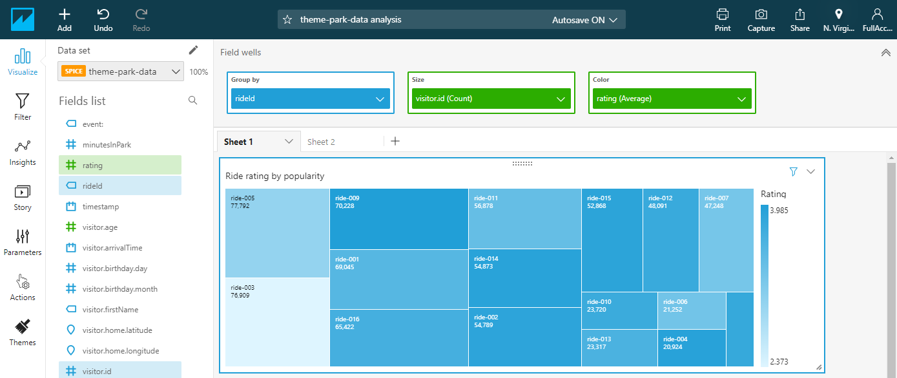

# Building visualizations #4

*[Click here](../README.md) to return the *Building visualizations* instructions at any time.*

To create the visualization, follow these steps from QuickSight analysis dashboard.

## Ride rating by popularity

This visualization uses a Tree Map - the size of each box represents the total number of riders per ride, while the color coding indicates the average rating.

**:white_check_mark: Step-by-step Instructions**

1. Click the **Add** dropdown in the top menu bar, choose **Add visual**.
1. Click **Filter** in the *Analysis menu bar*, then choose **Create one...**.
1. Choose **event** from the list. Click *event* and check **Ride**. Choose **Apply** then **Close**.
1. Click **Visualize** in the *Analysis menu bar*.
1. In *Visualization types*, choose **Tree map**.
1. Click the *Field Wells* panel to open this section.
1. Drag **rideId** from the *Fields list* to the *Group by* box in the *Field wells*.
1. Drag **visitor.id** from the *Fields list* to the *Size* box in the *Field wells*.
1. Drag **rating** from the *Fields list* to the *Color* box in the *Field wells*.
1. Click the dropdown arrow next to the *rating* field in the well, select the *Aggregate* sub-menu and choose **Average**.
1. Click the title of the visualization and rename from *Insight* to *Ride rating by popularity*.

The finished visualization is shown below.

## Next steps

Go back to [Building visualizations](./README.md#building-visualizations).