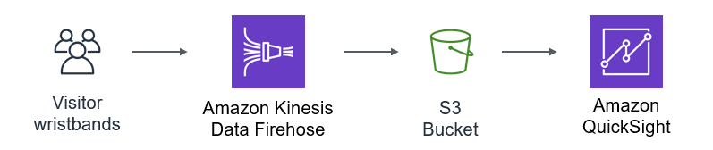

# Module 5: Analyzing visitor stats

## Overview

Each park visitor has a wristband that collects data throughout the day. It records when visitors arrive and leave, and keeps track of every ride they visit. 

When participants exit each ride, they tap the wristband on a ratings collection device. This leaves a rating from 1 (bad) to 5 (great). The wristband also transmits information about the visitor's name, age and home location.

In this section, you build the *Amazon Kinesis Firehose delivery stream* to receive the data. You'll set up a simulator to generate example messages, and then use *Amazon QuickSight* for find insights about the park's visitors.

:video_camera: This module is also available to [watch on YouTube](https://www.youtube.com/watch?v=-2vI4PwVKHU&list=PLJo-rJlep0EAkkjo7w_RmTV3S27tTmXDg).

## How it works

Every tap from a wristband creates an IoT message routed to the Amazon Kinesis Firehose delivery stream. 

There are three types of event currently monitored in the park: *Entry*, *Ride* and *Exit*.

* All messages are sent to the Kinesis Firehose delivery stream. This ingests large numbers of messages and stores the result in Amazon S3.

* Since the theme park hasn't opened yet, you will deploy a simulator to generate messages. This simulates data from ~70,000 visitors over the course of a 12-hour day.

* You will configure Amazon QuickSight to provide business analytics for our bosses running the park!

## The Serverless Backend



1. The wristbands emit messages through the IoT infrastructure. These are sent to  Kinesis Firehose.
2. Firehose aggegrates data into objects stored in a dedicated S3 bucket.
3. QuickSight uses the objects in the S3 bucket as a data source for analysis.

## Set up environment variables

Run the following commands in the Cloud9 terminal to set environment variables used in this workshop:

```console
AWS_REGION=$(curl -s http://169.254.169.254/latest/meta-data/placement/availability-zone | sed 's/\(.*\)[a-z]/\1/')
accountId=$(curl -s http://169.254.169.254/latest/dynamic/instance-identity/document | jq -r .accountId)
s3_deploy_bucket="theme-park-sam-deploys-${accountId}"
```

## Configure the infrastructure

There are three sub-sections to this module:

1. [Configure Kinesis Firehose](./1-firehose/README.md)
2. [Deploy and run the simulator](./2-simulator/README.md)
3. [Configure and use QuickSight](./3-quicksight/README.md)

To start the first section, [click here to continue](./1-firehose/README.md).

