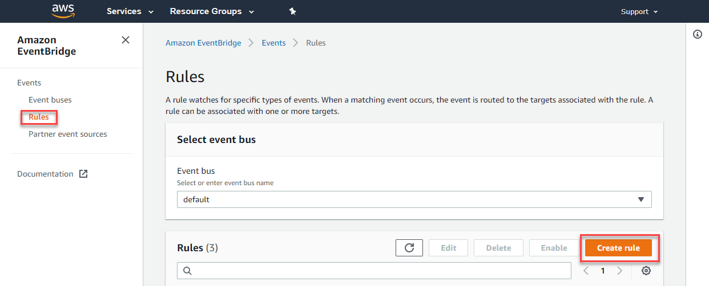
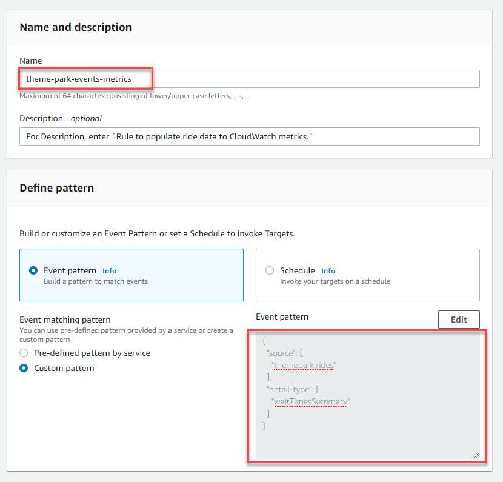
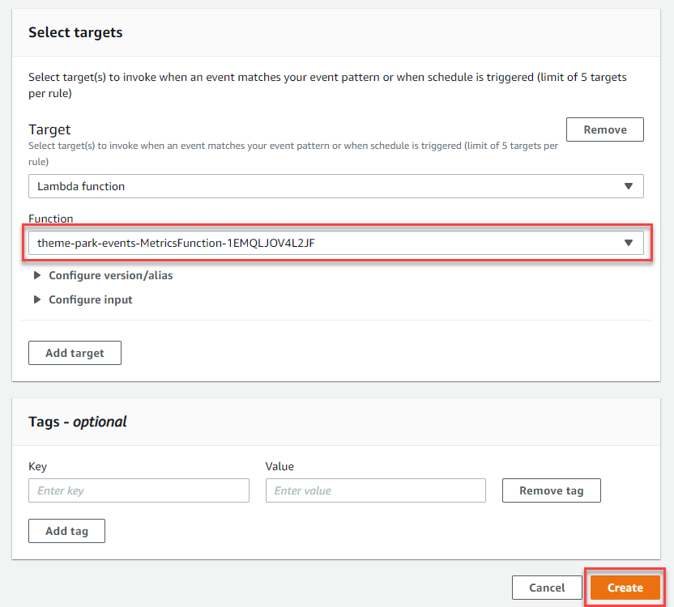
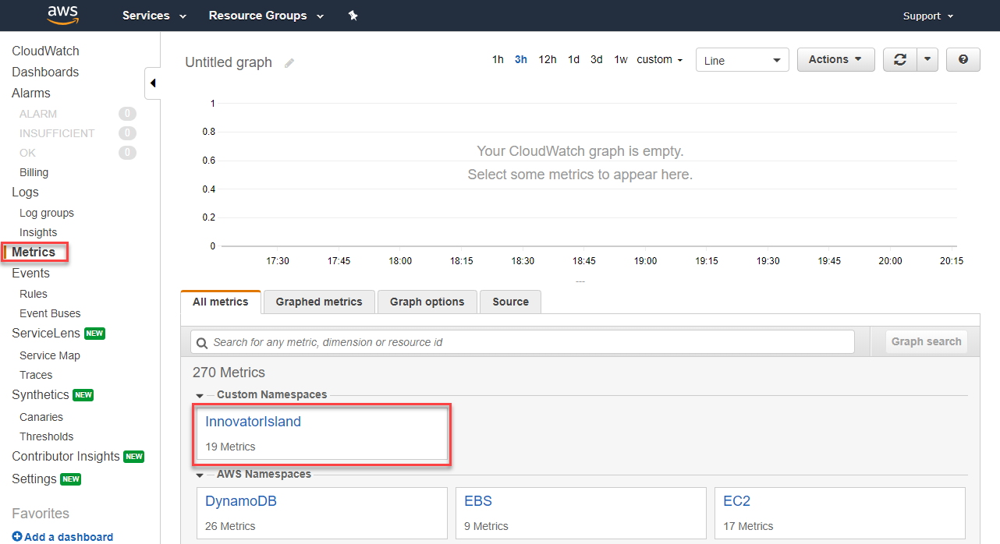
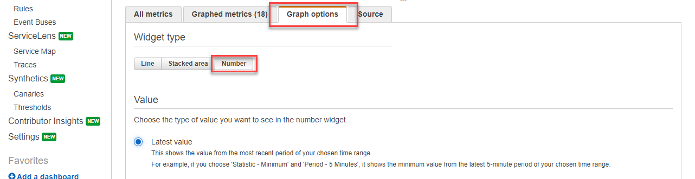

# Module 6: Developing event-based architecture - (1) Configure the event bus and metrics dashboard

*[Click here](../README.md) to return the main instructions for Module 6 at any time.*

In the first part of this section, you will create a Lambda function to send the data from the SNS topic to Amazon EventBridge.

The second part, you will create a CloudWatch Metrics dashboard that enables Park Management to monitor all ride times. 

## Inside this section

*More information on the services introduced in this section:*
* [Amazon CloudWatch Dashboards](https://docs.aws.amazon.com/AmazonCloudWatch/latest/monitoring/CloudWatch_Dashboards.html)
* [Amazon CloudWatch Metrics](https://docs.aws.amazon.com/AmazonCloudWatch/latest/monitoring/working_with_metrics.html)

## 1. Connect SNS with EventBridge

**:white_check_mark: Step-by-step Instructions**

1. Go back to your browser tab with Cloud9 running. If you need to re-launch Cloud9, from the AWS Management Console, select **Services** then select **Cloud9** under *Developer Tools*.

#### :star: Make sure your region is set to the same region you initially selected for Cloud9.

2. Deploy the Lambda function by executing the following commands in the Cloud9 terminal:
```
cd ~/environment/theme-park-backend/6-eventbridge/1-eventbus/sam-app/

sam package --output-template-file packaged.yaml --s3-bucket $s3_deploy_bucket

sam deploy --template-file packaged.yaml --stack-name theme-park-events --capabilities CAPABILITY_IAM
```
3. After the SAM deployment is complete, go to the Lambda console - from the AWS Management Console, select **Services** then select **Lambda** under *Compute*. **Make sure your region is correct.** 

4. Select the Lambda function with the name beginning `theme-park-events-PublishFunction`.

- This function will be invoked by SNS after you create the trigger in the next section.
- The code iterates through the list of ride wait times in the incoming SNS message. It creates an event for each ride time and publishes to the default bus in EventBridge. For these events, the DetailType is `waitTimes`.
- It also publishes a single summary event to the EventBridge default bus using the DetailType `waitTimesSummary`.

5. Make sure the *Designer* section is expanded. Select **+ Add trigger**. In the *Trigger configuration* dropdown, choose **SNS**. In the SNS topic selector, select the topic beginning with `ride-times`: 


6. Leave *Enable trigger* checked, and choose *Add*.

The Lambda function is now receiving events from the SNS trigger, and publishing to EventBridge.

## 2. Publishing ride data to CloudWatch Metrics.

Now you are publishing ride events to EventBridge, you can build applications, services and functions based upon those events. You configure EventBridge rules to filter events and send those to designated targets. 

In this section, you will connect a Lambda function that publishes data to CloudWatch Metrics to EventBridge. The Lambda function was created in the last SAM deployment, so you only need to build the EventBridge rule to invoke the function.

**:white_check_mark: Step-by-step Instructions**

1. Go to EventBridge - from the AWS Management Console, select **Services** then select **EventBridge** under *Application Integration*. **Make sure your region is correct.** 

2. Open the side menu on the left and select **Rules**. Choose **Create rule**



3. In the Create rule page:
- For *Name*, enter `theme-park-events-metrics`.
- For Description, enter `Rule to populate ride data to CloudWatch metrics.`
- In *Define Pattern*, select the **Event pattern** radio button.
- Select *Custom pattern* to open the *Event pattern* panel.

4. In the *Event pattern* panel, copy and paste the following pattern:

```
{
  "source": [
    "themepark.rides"
  ],
  "detail-type": [
    "waitTimesSummary"
  ]
}
```
5. Choose **Save** in the *Event pattern* panel.



7. In the *Select targets* panel:
- Click the *Target* dropdown and select *Lambda function*.
- In the *Function* dropdown, select the function name beginning with `theme-park-events-MetricsFunction`.



8. Choose **Create**.

EventBridge will now filter events on the default bus and send events matching the pattern to the Lambda function that populates CloudWatch metrics.

## 3. Creating the dashboard

**:white_check_mark: Step-by-step Instructions**

1. Go to the AWS Management Console, click **Services** then select **CloudWatch** under Management & Governance. **Make sure your region is correct.**

2. On the left-side menu, choose **Metrics**. Click the custom namespace called **InnovatorIsland**.

#### :bulb: You have to wait a couple of minutes for this new metric to appear in CloudWatch Metrics.



3. Choose *Ride, Type*, then choose the *Select All* checkbox in the title bar to select all metrics.


4. Select the *Graph options* tab, then under *Widget type* choose the *Number* radio button. Leave *Latest value* selected.



5. Click the edit pencil next to the graph title, and enter `Ride times`.

6. Select the *Actions* dropdown and choose *Add to dashboard*. 

- Click *Create new* and enter `InnovatorIsland` for the dashboard name.
- For widget type, select *Number*.
- Choose **Add to dashboard**.


7. Choose **Save dashboard**.

You now have a dashboard showing wait times for all rides in the park. This can be shared with Park Operations to help monitor the state of all the rides.


## Next steps

Next, you will use EventBridge to route park maintenance events to interested targets. To start the next section, [click here to continue](../2-maintenance/README.md).

