# Module 6: Developing event-based architecture - (2) Identify and route maintenance events

*[Click here](../README.md) to return the main instructions for Module 6 at any time.*

The ride data system only provides basic status information about the ride. In this next section, you will extract information about outages and provide richer events, so the Operations Team at the park gain more insights into problems with the rides.

Next, you will create consumers for these richers events, routing outage-related information to various other services.

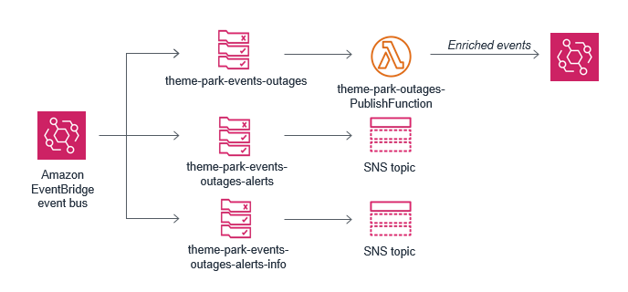

## Inside this section

*More information on the services introduced in this section:*
* [Amazon CloudWatch Dashboards](https://docs.aws.amazon.com/AmazonCloudWatch/latest/monitoring/CloudWatch_Dashboards.html)

## 1. Creating richer outage-related events

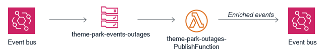

First, you will consume the ride data events already published by EventBridge from the last section. You'll filter the outage-related events, append more data about the outage, and push the information back onto the default event bus.

**:white_check_mark: Step-by-step Instructions**

1. Go back to your browser tab with Cloud9 running. If you need to re-launch Cloud9, from the AWS Management Console, select **Services** then select **Cloud9** under *Developer Tools*.

#### :star: Make sure your region is set to the same region you initially selected for Cloud9.

2. Deploy the Lambda function by executing the following commands in the Cloud9 terminal:
```
cd ~/environment/theme-park-backend/6-eventbridge/2-maintenance/sam-app/

sam package --output-template-file packaged.yaml --s3-bucket $s3_deploy_bucket

sam deploy --template-file packaged.yaml --stack-name theme-park-outages --capabilities CAPABILITY_IAM
```
3. Go to EventBridge - from the AWS Management Console, select **Services** then select **EventBridge** under *Application Integration*. **Make sure your region is correct.** 

4. Open the side menu on the left and select **Rules**. Choose **Create rule**


5. In the Create rule page:
- For *Name*, enter `theme-park-events-outages`.
- For Description, enter `Rule to filter rides with current outages.`
- In *Define Pattern*, select the **Event pattern** radio button.
- Select *Custom pattern* to open the *Event pattern* panel.

5. In the *Event pattern* panel, copy and paste the following pattern:

```
{
  "source": [
    "themepark.rides"
  ],
  "detail-type": [
    "waitTimes"
  ],
  "detail": {
    "inService": [
      false
    ]
  }
}
```
6. Choose **Save** in the *Event pattern* panel.

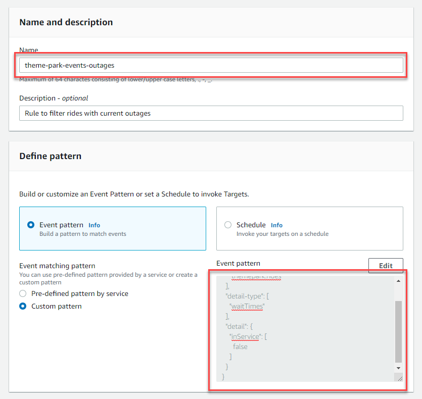

7. In the *Select targets* panel:
- Click the *Target* dropdown and select *Lambda function*.
- In the *Function* dropdown, select the function name beginning with `theme-park-outages-PublishFunction`.

8. Choose **Add target**. In the second target panel:
- Click the *Target* dropdown and select *CloudWatch log group*.
- Under *Log group*, next to the radio button with named */aws/events/*, enter `theme-park-outages`.


9. Choose **Create**.

10. Navigate to CloudWatch - from the AWS Management Console, select **Services** then select **CloudWatch** under *Management & Governance*.

11. From the menu on the left, select **Log groups** under the *Logs* category.

11. Choose the log group called `/aws/events/theme-park-outages`. After a minute or two, a log stream will appear - click to open this stream.

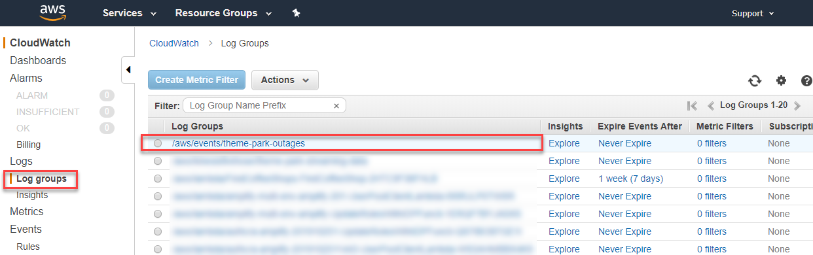

EventBridge will now filter events on the default bus and send events matching the pattern to the Lambda function and a CloudWatch log group. This Lambda function enriches those events with more outage information, and send these to the default eventbus with the *detail-type* `outage`.

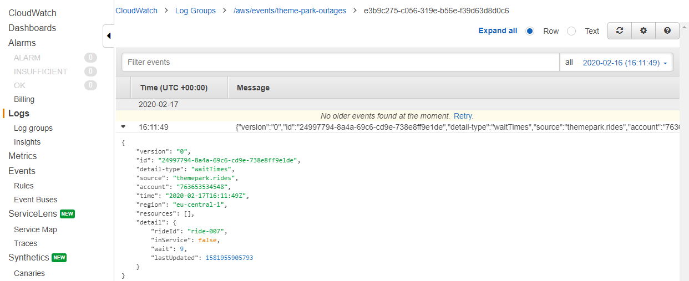

## 2. Creating alerts for Info/Warning outage events.

In this section you will consume the enriched events from the default event bus and route to interested targets.

First, you create two SNS topics. The first is for outages of type "Info" and "Warning", which you will route to your email. 

### Create the SNS topics and EventBridge rules

**:white_check_mark: Step-by-step Instructions**

1. Go to SNS - from the AWS Management Console, select **Services** then select **Simple Notification Service** under *Application Integration*. **Make sure your region is correct.** 

2. Select **Topics** on the left side menu, then choose **Create topic**.

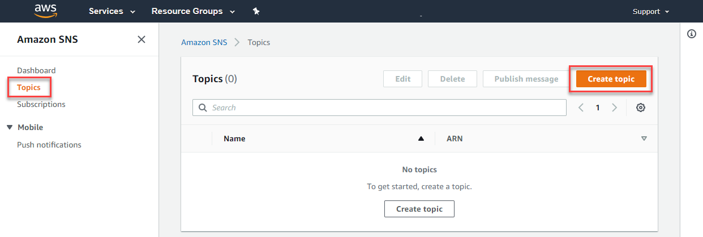

3. On the *Create topic* page:
- For *Name*, enter `theme-park-events-outages-alerts-info`.
- For *Display name*, enter `Topic for info and warning alerts`.
- Choose **Create topic**.


4. After the topic is created, choose **Create subscription**.


5. On the *Create subscription* page:
- For *Protocol* enter `Email-JSON`.
- For *Endpoint*, enter your email address.


6. Choose **Create subscription**.

7. You will receive an email at the address you entered in step 6. Wait for this email, and then click the confirmation link in the email.

8. Click **Topics** in the left-side menu, and choose *theme-park-events-outages-alerts-info*. You will see the status is *Confirmed*.


9. Go to EventBridge - from the AWS Management Console, select **Services** then select **EventBridge** under *Application Integration*. 

10. Open the side menu on the left and select **Rules**. Choose **Create rule**.


11. In the Create rule page:
- For *Name*, enter `theme-park-events-outages-alerts-info`.
- For Description, enter `Info and Warning outages`
- In *Define Pattern*, select the **Event pattern** radio button.
- Select *Custom pattern* to open the *Event pattern* panel.

12. In the *Event pattern* panel, copy and paste the following pattern:

```
{
  "source": [
    "themepark.rides"
  ],
  "detail-type": [
    "outage"
  ],
  "detail": {
    "type": [
      "Info",
      "Warning"
    ]
  }
}
```
13. Choose **Save** in the *Event pattern* panel.

14. In the *Select targets* panel:
- Click the *Target* dropdown and select *SNS topic*.
- In the *Topic* dropdown, select the function name beginning with `theme-park-events-outages-alerts-info`.

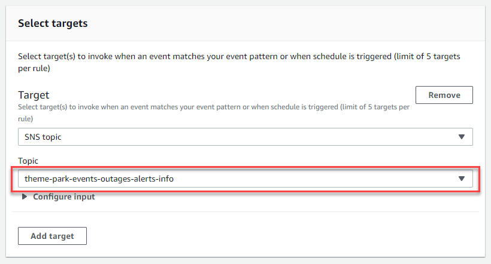

15. Choose **Create**.

You will now start to receive emails at your email address when outages occur with the *Info* or *Warning* state. 

## 3. Creating alerts for Emergency outage events.

#### :star: This section only works in AWS regions where SNS support SMS messaging. [See region list here](https://docs.aws.amazon.com/sns/latest/dg/sns-supported-regions-countries.html). Please skip this step if you are using a region outside of the United States.

In this section you will consume the enriched events from the default event bus and route to interested targets.

You will create an SNS topic for "Emergency" alerts, which will send an SMS message. You will then create an EventBridge rule to route events to this topic.

#### :bulb: You may be charged by your phone service carrier for receiving SMS messages.

### Create the SNS topics and EventBridge rules

**:white_check_mark: Step-by-step Instructions**

1. Go to SNS - from the AWS Management Console, select **Services** then select **Simple Notification Service** under *Application Integration*. **Make sure your region is correct.** 

2. Select **Topics** on the left side menu, then choose **Create topic**.


3. On the *Create topic* page:
- For *Name*, enter `theme-park-events-outages-alerts-emergency`.
- For *Display name*, enter `Topic for emergency alerts`.

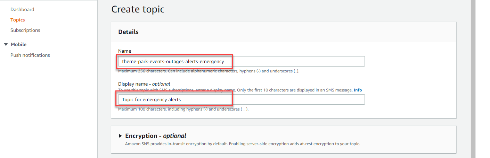

4. After the topic is created, choose **Create subscription**.

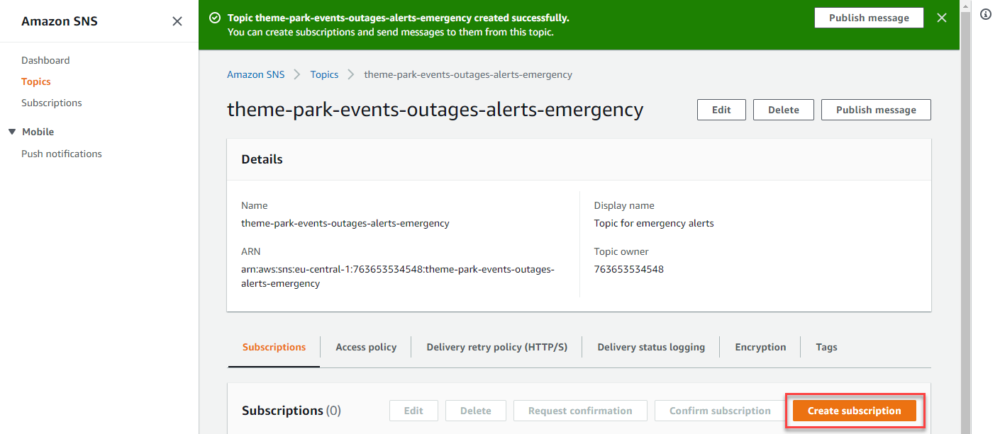

5. On the *Create subscription* page:
- For *Protocol* enter `SMS`.
- For *Endpoint*, enter your cell phone or mobile number, including the country code.


6. Choose **Create subscription**.

7. Go to EventBridge - from the AWS Management Console, select **Services** then select **EventBridge** under *Application Integration*. 

8. Open the side menu on the left and select **Rules**. Choose **Create rule**.


11. In the Create rule page:
- For *Name*, enter `theme-park-events-outages-alerts-emergency`.
- For Description, enter `Emergency outages`
- In *Define Pattern*, select the **Event pattern** radio button.
- Select *Custom pattern* to open the *Event pattern* panel.

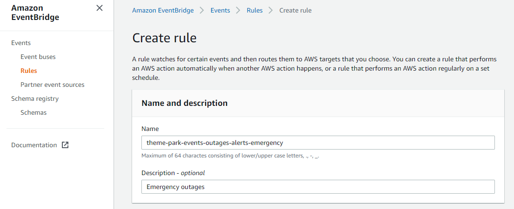

12. In the *Event pattern* panel, copy and paste the following pattern:

```
{
  "source": [
    "themepark.rides"
  ],
  "detail-type": [
    "outage"
  ],
  "detail": {
    "type": [
      "Emergency"
    ]
  }
}
```
13. Choose **Save** in the *Event pattern* panel.

14. In the *Select targets* panel:
- Click the *Target* dropdown and select *SNS topic*.
- In the *Topic* dropdown, select the function name beginning with `theme-park-events-outages-alerts-emergency`.

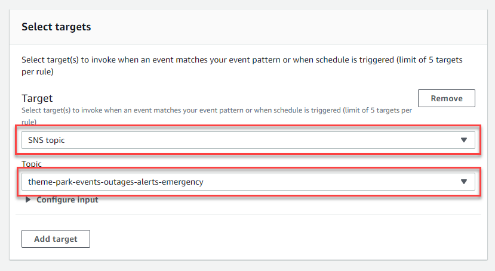

15. Choose **Create**.

You will now start to receive SMS message at your phone number when emergency outages occur on rides. 

## 4. Create a test event.

Whereas informational alerts happen frequently, it can take a few minutes for an emergency alert to occur. To simulate an emergency, you can generate a test event.

**:white_check_mark: Step-by-step Instructions**

1. Go back to your browser tab with Cloud9 running. If you need to re-launch Cloud9, from the AWS Management Console, select **Services** then select **Cloud9** under *Developer Tools*.

#### :star: Make sure your region is set to the same region you initially selected for Cloud9.

2. In the terminal, change the directory by entering:
```
cd ~/environment/theme-park-backend/6-eventbridge/2-maintenance/
```
3. Put a test event on the Eventbridge default event by running the following command:
```
aws events put-events --entries file://testEvent.json
```
Within a few seconds, you will receive an SMS on your phone with the emergency alert.

# Congratulations - you have completed Innovator Island!

Congratulations! You have completed building the theme park application. Please drop by the Innovator Island Human Resource office - we need talented developers like you!

Feel free to experiment with the completed application, and browse the AWS Management Console to see the backend services you have configured. Thanks for participating!

### Next steps

[Click here](../../00-cleanup/README.md) to see cleanup instructions for this workshop.
