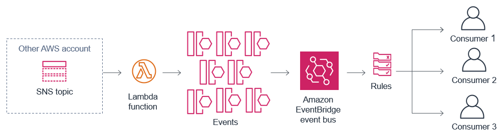

# Module 6: Developing event-based architecture

## Overview

The Flow & Traffic Controller system provides the web app with ride times via an SNS topic. 

Now the guests know about wait times and outages, but the park's maintenance staff don't know when ride systems are down. They would like notifications when problems occur. Since you have deployed the previous app already, we want to address this new requirement without making any changes to the existing infrastructure.

In this module, you are going to build new functionality that allows the park's maintenance teams to get alerts from the ride systems. 

:video_camera: This module is also available to [watch on YouTube](https://www.youtube.com/watch?v=PZlrwWqeq7Q&list=PLJo-rJlep0EAkkjo7w_RmTV3S27tTmXDg).

## How it works

You are going to connect the SNS topic with the ride data to Amazon EventBridge, a serverless event bus service.

* A Lambda function can push data from the SNS topic to EventBridge. This helps decouple the producers and consumers of events, so if there are any more "new requirements" later, it will be easy to address these without impacting existing systems.

* EventBridge uses rules to filter incoming events and decided where they should be routed. You will be using rules to filter a subset of events to each of three services you need to build.

*More information on the services introduced in this section:*
* [Amazon EventBridge](https://aws.amazon.com/eventbridge/)
* [Introduction to event buses (video)](https://www.youtube.com/watch?v=TXh5oU_yo9M&t=3s)
* [Integrating Amazon EventBridge into your serverless application](https://aws.amazon.com/blogs/compute/integrating-amazon-eventbridge-into-your-serverless-applications/)

## The Serverless Backend



* The *Flow & Traffic Controller* is a separate system in the park. You are provided with the SNS topic ARN to use.
* The Lambda function receive new messages from the SNS topic. It parses this message and sends events to the EventBridge event bus.
* EventBridge receives these events and uses rules to decide where they should be routed.
* Events are routed to any number of downstream consumers, which are completely decoupled from the event producers.

## Set up environment variables

Run the following commands in the Cloud9 terminal to set environment variables used in this workshop:

```console
AWS_REGION=$(curl -s http://169.254.169.254/latest/meta-data/placement/availability-zone | sed 's/\(.*\)[a-z]/\1/')
accountId=$(curl -s http://169.254.169.254/latest/dynamic/instance-identity/document | jq -r .accountId)
s3_deploy_bucket="theme-park-sam-deploys-${accountId}"
```

## Configure the infrastructure

There are two sub-sections to this module:

1. [Configure the event bus and metrics dashboard](./1-eventbus/README.md)
2. [Identify and route maintenance events](./2-maintenance/README.md)

To start the first section, [click here to continue](./1-eventbus/README.md).
