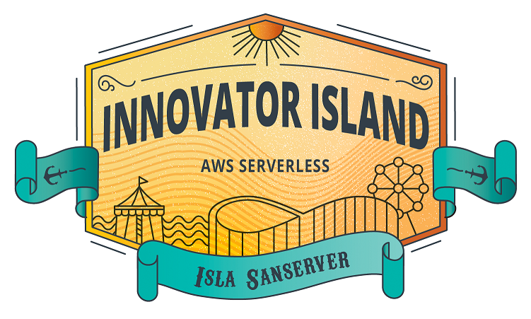
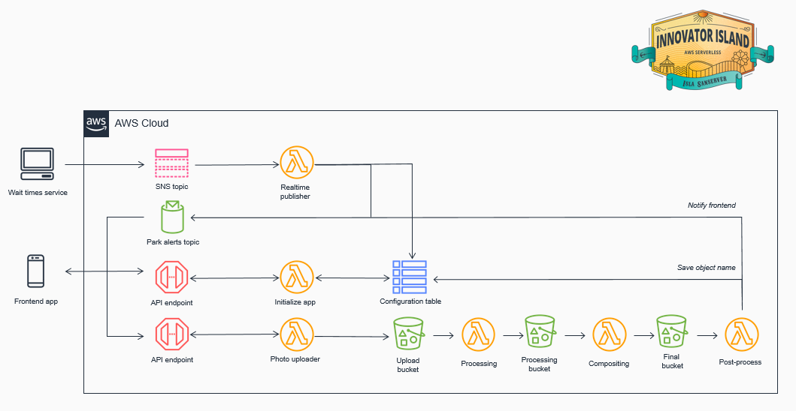

## The Innovator Island Workshop

In this workshop, you will be deploying a completely [serverless](https://aws.amazon.com/serverless/) web application built with AWS services.

You can follow this workshop at your own pace using the instructions in this repo, or attend a session at an AWS event where it is run.

If you are doing it at your own pace, there are video tutorials for each of the modules.

If you're attending this workshop at an AWS event, your instructor will provide an overview of the steps involved. There are AWS employees available to help with any of your questions - don't be afraid to ask if you get stuck!

# Welcome to the Theme Park!

This exciting new theme park, built on the remote island of Isla Sanserver, combines rollercoasters and rides with shows and exhibits. The park is the creation of the billionaire entrepreneur behind Wild Rydes, the unicorn taxi service that sold in 2018. The park will open every day and expects up to 50,000 visitors daily. It's self-guided, using a web application that guests can browse on their smartphones. 

The only "slight" problem is that the development team has suddenly left and the park's Grand Opening is today! You only have 2 hours to finish assembling the remaining pieces of the application before the gates open. But don't worry, serverless is at hand! These instructions will guide you through using AWS services to assemble a complete application so you can save the day.

## Application structure

You will be using a micro-services approach to configure a frontend and build a backend serverless application.

### Frontend
The frontend web application consists of an existing JavaScript web application managed with [AWS Amplify Console][amplify-console] that interfaces with services on the backend. You will only need to make minor changes to a configuration file in the frontend code to complete this workshop.

Amplify Console provides a simple, Git-based workflow for deploying and hosting fullstack serverless web applications. Amplify Console can create both the frontend and backend but for this workshop we will be using Amplify Console for only the frontend.

Amplify will be used to host static web resources including HTML, CSS, JavaScript, and image files which are loaded in the user's browser via S3. 

### Backend
The backend application architecture uses [AWS Lambda][lambda], [Amazon API Gateway][api-gw], [Amazon S3][s3], [Amazon DynamoDB][dynamodb], and [Amazon Cognito][cognito]. 

JavaScript executed in the frontend browser application sends and receives data from a public backend API built using API Gateway and Lambda. DynamoDB provides a persistence data storage layer which is used by the API's Lambda functions.

See the diagram below for the complete architecture.

## Start here

After completing the Initial Setup, follow the remaining modules in order:

Module # | Feature | Description
------------ | ------------- | -------------
[0](./0-setup/README.md) | Initial Setup | Setup the development environment and clone the repositories.
[1](./1-app-deploy/README.md) | Deploy the App | Deploy the initial frontend and backend applications.
[2](./2-realtime/README.md) | Ride wait times | Integrate your application with the ride systems so guests can see wait times.
[3](./3-photos/README.md) | Ride photos | Build a photo processing flow so guests can take selfies around the park.
[4](./4-translate/README.md) | Translation | Help international guests understand the app by adding language translation.
[5](./5-park-stats/README.md) | Analyzing visitor stats | Collecting and analyzing large amounts of data from park guests.
[6](./6-eventbridge/README.md) | Developing event-based architecture | Routing park maintenance events depending upon severity.
[Cleanup](./00-cleanup/README.md) | Cleanup workshop resources | How to remove all of the workshop's resources from your account.

If you run out of time in the workshop, don't panic! This GitHub repository is public and is available after your workshop ends.

## Deleting resources

If you are using an account provided at an AWS event, the account will be cleaned up automatically. 

If you are using your own AWS account, this workshop uses AWS services that are mostly covered by the Free Tier allowance (if your account is less than 12 months old) but it may incur some costs. To minimize cost, make sure you deprovision and delete those resources when you are finished. You can find the instructions for how to do that under [Cleanup](./00-cleanup/README.md).

**:loudspeaker: You are liable for the costs incurred of running this workshop.**

### Next steps

:white_check_mark: Proceed to [Module 0](./0-setup/README.md), where you'll start setting up the development environment.

[amplify-console]: https://aws.amazon.com/amplify/console/
[cognito]: https://aws.amazon.com/cognito/
[lambda]: https://aws.amazon.com/lambda/
[api-gw]: https://aws.amazon.com/api-gateway/
[s3]: https://aws.amazon.com/s3/
[dynamodb]: https://aws.amazon.com/dynamodb/
